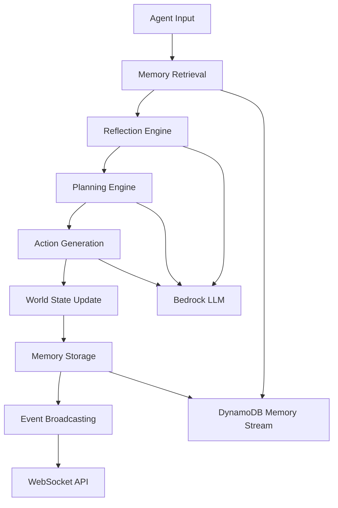

# Generative World System Architecture Plan

## System Overview

This system implements the Stanford Generative Agents research on AWS, creating a scalable platform where users can create and manage their own persistent world instances with full god-mode control over agents and environments.

### Key Requirements
- **Scalable Architecture**: Start small (25-50 agents) but grow to support thousands of agents over time
- **God Mode Control**: Users have full control to pause/resume time, edit agent memories, spawn/remove agents, and reshape environments
- **User-Controlled Instances**: Each user can create independent world instances with pause/resume capabilities
- **AWS Native**: Built on Amazon Bedrock, ECS, DynamoDB, and CloudFront
- **Public Access**: No authentication required for public availability

## Core Architecture Components

### 1. Frontend Layer (React/Next.js + CloudFront)

#### World Management Dashboard
- Create, load, save, and delete world instances
- World templates and presets
- Import/export world configurations
- User workspace management

#### Real-time World Viewer
- Interactive 2D/3D visualization of the world and agents
- Zoom and pan controls
- Agent movement tracking
- Environment object visualization
- Real-time agent action display

#### Agent Inspector
- View/edit agent memories, plans, reflections, and relationships
- Memory stream browser with filtering and search
- Relationship graph visualization
- Agent personality and goal editing
- Conversation history viewer

#### World Editor
- Modify environments and locations
- Spawn/remove agents with custom personalities
- Edit object states and properties
- Environmental event triggers
- World physics and rules configuration

#### Time Controls
- Play, pause, fast-forward simulation
- Time step granularity control
- Simulation speed adjustment
- Event timeline scrubbing
- Checkpoint creation and restoration

#### Natural Language Interface
- Communicate directly with agents
- Issue world-level commands
- Query agent thoughts and motivations
- Narrative event injection

### 2. API Gateway & Authentication

#### AWS API Gateway
- RESTful APIs for world management
- WebSocket APIs for real-time communication
- Request/response transformation
- CORS configuration for web access

#### Rate Limiting & Security
- Per-user rate limiting to prevent abuse
- Input validation and sanitization
- DDoS protection via CloudFront
- Cost monitoring and alerts

### 3. Core Services Layer (ECS Fargate)

#### World Management Service
- **World Lifecycle**: Create, delete, pause, resume world instances
- **Snapshot Management**: Save/load world state snapshots
- **Scaling Coordination**: Manage agent population growth
- **Resource Allocation**: Distribute computational resources
- **Metadata Management**: World settings, permissions, and configuration

#### Agent Runtime Service
- **Agent Engine**: Core generative agent implementation
  - Memory Stream management (observations, reflections, plans)
  - Memory retrieval with recency/importance/relevance scoring
  - Reflection generation and synthesis
  - Planning and action execution
  - Inter-agent dialogue generation
- **World Simulation Engine**: Manages world state and agent interactions
- **Time Management**: Handles simulation speed, pause/resume, time travel
- **Event Processing**: Processes agent actions and world events
- **Collision Detection**: Manages agent movement and interactions

#### LLM Integration Service
- **Amazon Bedrock Integration**: Primary LLM for agent cognition
- **Prompt Management**: Optimized prompts for different agent operations
- **Response Caching**: Cache common LLM responses to reduce costs
- **Batch Processing**: Group similar LLM requests for efficiency
- **Model Selection**: Choose appropriate models for different tasks
- **Context Management**: Maintain conversation context for agents

### 4. Data Layer

#### DynamoDB Tables

##### Worlds Table
```json
{
  "worldId": "uuid",
  "name": "World Name",
  "description": "World description",
  "createdAt": "ISO datetime",
  "lastModified": "ISO datetime",
  "status": "running|paused|stopped",
  "settings": {
    "timeSpeed": 1.0,
    "maxAgents": 1000,
    "worldSize": {"width": 1000, "height": 1000},
    "physics": {"gravity": true, "collision": true}
  },
  "currentTime": "simulation datetime",
  "agentCount": 25
}
```

##### Agents Table
```json
{
  "agentId": "uuid",
  "worldId": "uuid",
  "name": "Agent Name",
  "description": "personality and background",
  "currentLocation": {"x": 100, "y": 200, "area": "downtown"},
  "currentAction": "action description",
  "relationships": {"agent_id": "relationship_type"},
  "goals": ["long term goals"],
  "traits": ["personality traits"],
  "currentPlan": {
    "dailyPlan": ["high level activities"],
    "hourlyPlan": ["detailed actions"],
    "currentStep": "immediate action"
  },
  "status": "active|inactive|deleted"
}
```

##### MemoryStreams Table
```json
{
  "memoryId": "uuid",
  "agentId": "uuid",
  "worldId": "uuid",
  "type": "observation|reflection|plan",
  "content": "natural language description",
  "timestamp": "ISO datetime",
  "importance": 1-10,
  "lastAccessed": "ISO datetime",
  "relatedMemories": ["memory_ids"],
  "embedding": [vector_representation],
  "tags": ["conversation", "work", "relationship"]
}
```

##### WorldObjects Table
```json
{
  "objectId": "uuid",
  "worldId": "uuid",
  "type": "building|furniture|vehicle|item",
  "name": "Object Name",
  "location": {"x": 100, "y": 200, "area": "downtown"},
  "state": {"occupied": false, "condition": "good"},
  "properties": {"capacity": 4, "function": "seating"},
  "interactions": ["sit", "use", "move"]
}
```

##### Events Table
```json
{
  "eventId": "uuid",
  "worldId": "uuid",
  "timestamp": "ISO datetime",
  "type": "agent_action|world_event|user_intervention",
  "agentId": "uuid (if applicable)",
  "description": "event description",
  "data": {"action": "details", "location": "coordinates"},
  "consequences": ["resulting changes"]
}
```

##### Snapshots Table
```json
{
  "snapshotId": "uuid",
  "worldId": "uuid",
  "name": "Snapshot Name",
  "timestamp": "ISO datetime",
  "s3Location": "s3://bucket/path/snapshot.json.gz",
  "size": 1024000,
  "agentCount": 25,
  "description": "snapshot description"
}
```

#### S3 Storage
- **World Assets**: Environment maps, textures, agent avatars
- **Backup Snapshots**: Compressed world state snapshots
- **User Uploads**: Custom content uploaded by users
- **Static Assets**: Frontend application files served via CloudFront

### 5. Real-time Communication

#### WebSocket API
- Real-time updates for world state changes
- Agent movement and action broadcasting
- User interaction event streaming
- Simulation status updates

#### EventBridge
- Event-driven architecture for system coordination
- Cross-service communication
- Event replay capabilities
- Custom event routing

#### SQS
- Message queuing for agent action processing
- Dead letter queues for error handling
- Batch processing coordination
- Load balancing across service instances

## Detailed Component Design

### Agent Architecture Implementation



#### Memory Retrieval Algorithm
1. **Query Formation**: Convert current situation to search query
2. **Relevance Scoring**: Use embedding similarity for relevance
3. **Recency Scoring**: Exponential decay based on time since last access
4. **Importance Scoring**: LLM-generated importance ratings (1-10)
5. **Combined Scoring**: Weighted combination of all three factors
6. **Context Window**: Select top-ranked memories that fit in LLM context

#### Reflection Generation Process
1. **Trigger Conditions**: Sum of importance scores exceeds threshold (150)
2. **Question Generation**: LLM generates salient questions about recent experiences
3. **Memory Gathering**: Retrieve relevant memories for each question
4. **Insight Extraction**: LLM synthesizes insights with evidence citations
5. **Storage**: Store reflections as new memory objects with pointers to evidence

#### Planning Hierarchy
1. **Daily Plans**: High-level goals and activities (5-8 items)
2. **Hourly Plans**: Detailed actions for each hour
3. **Minute Plans**: Specific actions for immediate execution
4. **Reactive Planning**: Dynamic replanning based on observations

### Scalability Design

#### Horizontal Scaling Strategy

##### Agent Partitioning
- Distribute agents across multiple ECS tasks
- Use consistent hashing for agent-to-task assignment
- Maintain agent locality for interaction efficiency
- Support agent migration between tasks

##### World Sharding
- Large worlds split into geographic regions
- Cross-region communication via message passing
- Load balancing based on agent density
- Dynamic region resizing based on activity

##### Service Scaling
- Auto Scaling Groups for ECS tasks
- Target tracking scaling policies
- Predictive scaling based on usage patterns
- Cost-optimized scaling with spot instances

#### Performance Optimizations

##### Memory Retrieval Caching
- Redis cache for frequently accessed memories
- LRU eviction policy
- Cache warming for active agents
- Distributed cache across service instances

##### LLM Response Caching
- Content-based cache keys
- Semantic similarity matching
- Cache hit rate monitoring
- Intelligent cache invalidation

##### Batch Processing
- Group similar LLM requests
- Parallel processing of independent agents
- Asynchronous action execution
- Bulk database operations

##### Data Optimization
- Memory stream compression
- Embedding vector quantization
- Lazy loading of agent data
- Efficient serialization formats

### Cost Management

#### LLM Cost Optimization

##### Smart Caching Strategy
- Cache responses by semantic similarity
- Share cache across similar agents
- Cache reflection and planning outputs
- Monitor cache hit rates and ROI

##### Batch Processing
- Group agent actions by type
- Batch similar prompts together
- Reduce API call overhead
- Optimize prompt engineering for efficiency

##### Importance Filtering
- Only use LLM for high-importance decisions
- Simple rule-based actions for routine behaviors
- Graduated response complexity
- Cost-benefit analysis for LLM usage

##### Model Selection
- Use appropriate Bedrock models for different tasks
- Smaller models for simple decisions
- Larger models for complex reasoning
- Dynamic model selection based on context

#### Infrastructure Cost Control

##### Resource Optimization
- Spot instances for non-critical workloads
- Reserved instances for predictable workloads
- Auto scaling based on demand
- Resource right-sizing based on metrics

##### Data Lifecycle Management
- Archive old world data to Glacier
- Compress inactive memory streams
- Automatic cleanup of temporary data
- Tiered storage based on access patterns

##### Monitoring and Alerting
- Real-time cost tracking
- Budget alerts and limits
- Cost attribution by user/world
- Optimization recommendations

## Implementation Phases

### Phase 1: Core Foundation (Weeks 1-4)

#### Infrastructure Setup
- AWS account and IAM configuration
- VPC, subnets, and security groups
- ECS cluster and task definitions
- DynamoDB table creation
- S3 bucket configuration
- CloudFront distribution setup

#### Basic Agent Architecture
- Memory stream data model
- Simple agent state management
- Basic LLM integration with Bedrock
- Agent action processing pipeline

#### Simple World Engine
- World state representation
- Agent movement and positioning
- Basic object interaction
- Time progression mechanics

#### Minimal Frontend
- React application setup
- Basic world visualization
- Agent status display
- Simple controls for pause/play

### Phase 2: Agent Intelligence (Weeks 5-8)

#### Memory System
- Memory retrieval algorithm implementation
- Embedding generation and storage
- Importance scoring system
- Memory access tracking

#### Reflection Engine
- Reflection trigger conditions
- Question generation prompts
- Insight synthesis and storage
- Reflection tree construction

#### Planning System
- Hierarchical plan generation
- Plan execution and monitoring
- Reactive replanning
- Goal-driven behavior

#### Inter-Agent Communication
- Dialogue generation system
- Conversation context management
- Relationship tracking
- Social dynamics modeling

### Phase 3: User Interface (Weeks 9-12)

#### World Editor
- Environment modification tools
- Agent spawning and configuration
- Object placement and editing
- World template system

#### Agent Inspector
- Memory browser interface
- Relationship visualization
- Personality editing tools
- Conversation history viewer

#### Time Controls
- Simulation speed controls
- Pause/resume functionality
- Time scrubbing interface
- Checkpoint system

#### Advanced Visualization
- 3D world rendering
- Agent animation system
- Real-time updates
- Performance optimization

### Phase 4: Scalability & Polish (Weeks 13-16)

#### Horizontal Scaling
- Multi-task agent distribution
- Load balancing implementation
- Auto scaling configuration
- Performance monitoring

#### Advanced Features
- World import/export
- Agent behavior analytics
- Custom event scripting
- API documentation

#### Optimization
- Performance profiling and tuning
- Cost optimization implementation
- Cache optimization
- Database query optimization

#### Production Readiness
- Comprehensive testing
- Error handling and recovery
- Monitoring and alerting
- User documentation

## Infrastructure as Code

### Terraform Structure
```
infrastructure/
├── modules/
│   ├── networking/
│   │   ├── vpc.tf
│   │   ├── subnets.tf
│   │   ├── security_groups.tf
│   │   └── outputs.tf
│   ├── compute/
│   │   ├── ecs.tf
│   │   ├── load_balancer.tf
│   │   ├── auto_scaling.tf
│   │   └── outputs.tf
│   ├── storage/
│   │   ├── dynamodb.tf
│   │   ├── s3.tf
│   │   ├── elasticache.tf
│   │   └── outputs.tf
│   ├── security/
│   │   ├── iam.tf
│   │   ├── kms.tf
│   │   └── outputs.tf
│   └── monitoring/
│       ├── cloudwatch.tf
│       ├── xray.tf
│       └── outputs.tf
├── environments/
│   ├── dev/
│   │   ├── main.tf
│   │   ├── variables.tf
│   │   └── terraform.tfvars
│   ├── staging/
│   │   ├── main.tf
│   │   ├── variables.tf
│   │   └── terraform.tfvars
│   └── prod/
│       ├── main.tf
│       ├── variables.tf
│       └── terraform.tfvars
└── shared/
    ├── backend.tf
    ├── providers.tf
    └── variables.tf
```

### Key AWS Services Configuration

#### ECS Fargate
- Auto-scaling container orchestration
- Task definitions for each service
- Service discovery via AWS Cloud Map
- Health checks and rolling deployments

#### Application Load Balancer
- Traffic distribution across service instances
- Health checks and automatic failover
- SSL termination and security headers
- WebSocket support for real-time features

#### DynamoDB
- On-demand billing with auto-scaling
- Global secondary indexes for queries
- Point-in-time recovery enabled
- Encryption at rest and in transit

#### S3
- Intelligent tiering for cost optimization
- Versioning for world snapshots
- Cross-region replication for disaster recovery
- CloudFront integration for global delivery

#### CloudFront
- Global content delivery network
- Caching strategies for static and dynamic content
- Custom error pages and redirects
- Security headers and DDoS protection

## Security Considerations

### Network Security
- **VPC Configuration**: Private subnets for backend services
- **Security Groups**: Least privilege access rules
- **NACLs**: Additional network-level protection
- **NAT Gateways**: Secure outbound internet access

### Identity and Access Management
- **IAM Roles**: Service-specific permissions
- **Least Privilege**: Minimal required permissions
- **Cross-Account Access**: Secure resource sharing
- **Audit Logging**: CloudTrail for all API calls

### Data Protection
- **Encryption at Rest**: All data encrypted in DynamoDB and S3
- **Encryption in Transit**: TLS for all communications
- **Key Management**: AWS KMS for encryption keys
- **Data Classification**: Sensitive data identification and protection

### Application Security
- **Input Validation**: Sanitize all user inputs
- **Rate Limiting**: Prevent abuse and DoS attacks
- **CORS Configuration**: Secure cross-origin requests
- **Content Security Policy**: Prevent XSS attacks

### Compliance and Privacy
- **Data Residency**: Control data location
- **GDPR Compliance**: User data rights and protection
- **Audit Trails**: Comprehensive logging and monitoring
- **Data Retention**: Automated cleanup policies

## Monitoring & Observability

### CloudWatch Metrics
- **System Metrics**: CPU, memory, disk, network utilization
- **Application Metrics**: Request rates, response times, error rates
- **Business Metrics**: Active worlds, agent count, user engagement
- **Cost Metrics**: Service costs and budget tracking

### Distributed Tracing
- **X-Ray Integration**: End-to-end request tracing
- **Service Maps**: Visualize service dependencies
- **Performance Analysis**: Identify bottlenecks and optimization opportunities
- **Error Analysis**: Root cause analysis for failures

### Custom Metrics
- **Agent Behavior**: Action frequency, conversation patterns
- **World Statistics**: Population dynamics, event rates
- **User Engagement**: Session duration, feature usage
- **Performance KPIs**: Simulation speed, response times

### Alerting and Notifications
- **CloudWatch Alarms**: Automated alerting on metric thresholds
- **SNS Integration**: Multi-channel notifications
- **Escalation Policies**: Tiered response procedures
- **Runbook Automation**: Automated incident response

### Logging Strategy
- **Centralized Logging**: CloudWatch Logs for all services
- **Structured Logging**: JSON format for easy parsing
- **Log Retention**: Automated cleanup based on importance
- **Log Analysis**: CloudWatch Insights for querying and analysis

## Deployment Strategy

### CI/CD Pipeline
- **Source Control**: Git-based version control
- **Build Pipeline**: Automated testing and building
- **Deployment Pipeline**: Blue-green deployments
- **Rollback Strategy**: Automated rollback on failures

### Environment Management
- **Development**: Isolated environment for feature development
- **Staging**: Production-like environment for testing
- **Production**: Live environment with full monitoring
- **Disaster Recovery**: Cross-region backup and recovery

### Release Management
- **Feature Flags**: Gradual feature rollouts
- **Canary Deployments**: Risk mitigation for new releases
- **A/B Testing**: Data-driven feature validation
- **Rollback Procedures**: Quick recovery from issues

This comprehensive architecture provides a robust foundation for building a scalable generative world system that can start small and grow to support thousands of agents while giving users complete control over their world instances. The design emphasizes cost efficiency, security, and maintainability while leveraging AWS managed services for reliability and scalability.